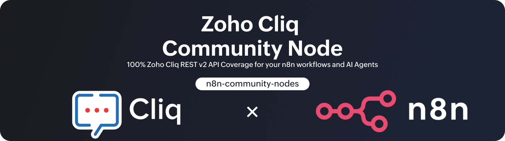

<p align="center">
  
</p>

# n8n-nodes-zoho-cliq

A production ready [n8n](https://n8n.io/) community node for the [Zoho Cliq](https://www.zoho.com/cliq/) REST API v2.

This node provides complete coverage of the Zoho Cliq API from a single, consistent n8n node. Every resource and every operation in the Zoho Cliq REST API v2 is implemented, tested, and documented. Beyond raw API coverage, the node adds meaningful enhancements that make working with Zoho Cliq in n8n significantly more reliable, more automatable, and more useful for both deterministic workflows and AI-powered agents.

## Disclaimer

This project is **not affiliated with, endorsed by, or associated with Zoho or Zoho Cliq** in any capacity. It is an independent, community-built n8n node created by an individual developer. I cannot provide support for Zoho's services, APIs, account issues, or platform behavior. For Zoho-specific questions, please refer to [Zoho Cliq's official documentation](https://www.zoho.com/cliq/help/restapi/v2/) and [Zoho's support channels](https://help.zoho.com/).

## Table of Contents

- [Disclaimer](#disclaimer)
- [Installation](#installation)
- [Credentials](#credentials)
- [API Coverage](#api-coverage)
- [Custom Enhancements](#custom-enhancements)
- [AI Agent Tool Support](#ai-agent-tool-support)
- [Development](#development)
- [References](#references)
- [Credits](#credits)
- [Coding Agent Credits](#coding-agent-credits)
- [License](#license)

## Installation

Install this package as a standard n8n community node.

### n8n Community Nodes UI (Recommended)

1. Open your n8n instance.
2. Navigate to **Settings** > **Community Nodes**.
3. Select **Install**.
4. Enter the package name below.
5. Approve the installation prompt and restart n8n if required.

### Package Name

```text
n8n-nodes-zoho-cliq
```

## Credentials

This node uses OAuth2 via the **Zoho Cliq OAuth2 API** credential type.

Start with the setup guide included in this repository for the exact credential configuration flow used by this node, then use the official Zoho references for underlying OAuth protocol details.

- [Credentials Setup Guide](documentation/CREDENTIALS.md)
- [Zoho OAuth Protocol](https://www.zoho.com/accounts/protocol/oauth.html)
- [Zoho Cliq REST Authentication](https://www.zoho.com/cliq/help/restapi/v2/#authentication)

## API Coverage

This node implements 100% of the Zoho Cliq REST API v2 surface. Every resource group, every endpoint, and every operation is covered. In addition to the full API surface, the node includes custom helper resources that exist only in this package to solve real workflow problems that the Zoho Cliq API does not address on its own.

Over 160 operations are organized across 25 resources.

### Core Messaging and Collaboration

| Resource | Description | Documentation |
| --- | --- | --- |
| Message | Post, edit, delete, retrieve, get, and schedule messages across channels, chats, bots, and users | [Operations](documentation/Message.md) |
| Thread | Create, reply to, and manage threaded conversations within channels | [Operations](documentation/Thread.md) |
| Reaction | Add, remove, and retrieve emoji reactions on messages | [Operations](documentation/Reaction.md) |
| File | Upload, retrieve, and share files into conversations | [Operations](documentation/Files.md) |
| Channel | Create, update, delete, and manage channel memberships, permissions, and settings | [Operations](documentation/Channel.md) |
| Chat | List, mute, unmute, pin, unpin, and leave direct message and group chat conversations | [Operations](documentation/Chat.md) |
| Bot | Retrieve bot subscribers and trigger bot-initiated calls | [Operations](documentation/Bot.md) |

### Organization and Administration

| Resource | Description | Documentation |
| --- | --- | --- |
| User | Look up, list, and manage user profiles and organization members | [Operations](documentation/User.md) |
| Team | Create, update, delete, and manage team memberships | [Operations](documentation/Team.md) |
| Department | Create, update, delete, and manage department memberships | [Operations](documentation/Department.md) |
| Role | Create, update, delete roles and manage role permissions and user assignments | [Operations](documentation/Role.md) |
| Designation | Create, list, delete designations and manage designation members | [Operations](documentation/Designation.md) |
| User Field | Retrieve and manage custom user profile fields | [Operations](documentation/UserField.md) |
| User Status | Get, set, and clear user presence and status information | [Operations](documentation/UserStatus.md) |
| Custom Domain | Add, verify, get, and delete custom domains for the organization | [Operations](documentation/CustomDomain.md) |
| Custom Email | Verify and update organization email configuration | [Operations](documentation/CustomEmail.md) |
| Database | Create, list, and delete Cliq Database storage entries | [Operations](documentation/Database.md) |
| Widget Map Ticker | Add, update, and delete widget map ticker entries | [Operations](documentation/WidgetMapTicker.md) |
| Bulk Action | Export channel and conversation data for compliance and backup | [Operations](documentation/BulkAction.md) |

### Workflow and Scheduling

| Resource | Description | Documentation |
| --- | --- | --- |
| Event | List events, get calendars, and upload calendar attachments | [Operations](documentation/Events.md) |
| Reminder | Create and manage reminders | [Operations](documentation/Reminders.md) |
| Remote Work | Manage remote work status entries (clock in, clock out, check status) | [Operations](documentation/RemoteWork.md) |
| Calls and Meetings | List call recordings and retrieve recording details | [Operations](documentation/CallsMeeting.md) |

### Helper Resources

These resources are custom additions that do not map to Zoho Cliq API endpoints. They run locally within the node to solve common workflow problems.

| Resource | Description | Documentation |
| --- | --- | --- |
| Message Component Builder | Build and validate rich Cliq message payloads, card payloads, buttons, slides, tables, charts, graphs, and ACK messages without making API calls | [Operations](documentation/MessageComponentBuilder.md) |
| OAuth Helper | Inspect granted scopes, discover scope packs, and validate scope coverage against the connected credential | [Operations](documentation/OAuthHelper.md) |

## Custom Enhancements

This node is not a thin API wrapper. It includes several purpose-built enhancements that address real limitations in the Zoho Cliq API and improve the experience of building production workflows.

### Preflight Validation and Structured Error Handling

The Zoho Cliq API often returns sparse, inconsistent, or unhelpful error responses. This node addresses that with a global preflight validation layer and structured error normalization.

Before any request is sent to the Zoho Cliq API, inputs are validated locally. IDs, email addresses, timestamps, enum values, and required fields are checked against expected formats. When validation fails, the node produces a structured error response with:

- A machine-readable error code (e.g., `CHANNEL_NOT_FOUND`, `USER_NOT_FOUND`, `THREAD_NOT_FOUND`, `USER_IDS_NOT_TEAM_MEMBERS`, `DEPARTMENT_NOT_FOUND`)
- A human-readable error message describing what went wrong
- A hint with actionable guidance for resolving the issue
- The resource and operation context so the error is traceable

These structured error responses are available when the node is configured with **Continue On Fail** enabled or when **AI Error Mode** is active. This design allows both deterministic workflows (using If/Switch nodes to branch on error codes) and AI agents (which can read the error output and decide how to recover) to handle failures gracefully instead of halting execution.

### Enhanced Output for Sparse API Responses

Several Zoho Cliq API endpoints return only an empty string on success, which makes downstream workflow chaining difficult. For these operations, the node provides an optional **Enable Enhanced Output** toggle. When enabled, the node constructs a richer output object that includes the mutated item data, the resource and operation names, and a `success: true` field, giving downstream nodes something meaningful to work with.

### Rich Message Payload Builders

The Message Component Builder resource provides local, no-API-call operations for constructing valid Zoho Cliq message payloads with full access to the Cliq message format. This includes:

- **Card Payload Builder** for structured card messages with themes and formatting
- **Agent Card Payload Builder** optimized for AI agent output
- **Button Builder** for interactive button arrays
- **Slide Component Builders** for Tables, Charts, Graphs, Images, Labels, and Lists
- **General Component Builder** for assembling multiple slide components into a complete payload

These builders output valid JSON objects that can be passed directly into message-sending operations, eliminating the need to manually construct complex Cliq message structures.

### ACK Message Builder for Bot Conversations

When using Zoho Cliq bots backed by n8n AI Agent workflows (triggered via webhook), there is an inherent delay while the AI agent processes the user's message. During this delay, the user sees nothing in the Cliq chat, which creates a poor experience.

The **Build and Fire ACK Message** operation solves this by sending an immediate acknowledgment message to the bot conversation with a configurable loading state. This message appears instantly in the Cliq chat while the AI agent processes the request. Later in the workflow, the acknowledgment message can be edited or replaced with the actual AI response.

The operation includes:

- Configurable acknowledgment text (single message, random from array, or preset random messages)
- Message styling options (standard, bold, heading)
- Card theme support (basic, poll, prompt, modern-inline)
- Animated spinner thumbnails from the [svg-spinners](https://github.com/n3r4zzurr0/svg-spinners) collection served via [Iconify](https://icon-sets.iconify.design/svg-spinners/) with 40+ spinner animations to choose from

### OAuth Helper Operations

Zoho OAuth scope configuration is notoriously difficult to get right, especially when an integration spans messaging, admin, calendar, storage, and remote work operations. The built-in OAuth Helper resource provides operations to:

- Inspect the scopes currently granted on the connected OAuth token
- Discover available scope packs and what they include
- Validate that the connected credential has the scopes required for specific operations

These operations run directly against the credential without calling any Cliq API endpoints, making them a safe diagnostic tool that can be used in any workflow.

## AI Agent Tool Support

Every operation in this node (over 160) is designed to work as an AI tool in n8n agent workflows via `usableAsTool: true`. Beyond the standard n8n AI tool compatibility, this package includes a complete library of **AI Agent Tool Field Guides** with per-operation setup instructions for configuring each operation as a tool.

Each guide includes:

- A suggested **Tool Description** ready to paste into the n8n tool configuration
- **Plain-text field descriptions** for every input parameter, written for AI comprehension
- Suggested **`$fromAI()` expressions** with parameter names, descriptions, types, and default values
- Required vs. optional field guidance so the agent knows what it must provide vs. what it can omit

These guides were developed and tested iteratively against a Claude-powered AI agent in n8n to verify that the suggested descriptions and expressions produce reliable, correct tool calls across all operations.

| Resource | AI Tool Field Guide |
| --- | --- |
| Bot | [Guide](AiAgentToolDescriptions/Resources/Bot/README.md) |
| Bulk Action | [Guide](AiAgentToolDescriptions/Resources/BulkAction/README.md) |
| Calls and Meetings | [Guide](AiAgentToolDescriptions/Resources/CallsMeeting/README.md) |
| Channel | [Guide](AiAgentToolDescriptions/Resources/Channel/README.md) |
| Chat | [Guide](AiAgentToolDescriptions/Resources/Chat/README.md) |
| Custom Domain | [Guide](AiAgentToolDescriptions/Resources/CustomDomain/README.md) |
| Custom Email | [Guide](AiAgentToolDescriptions/Resources/CustomEmail/README.md) |
| Database | [Guide](AiAgentToolDescriptions/Resources/Database/README.md) |
| Department | [Guide](AiAgentToolDescriptions/Resources/Department/README.md) |
| Designation | [Guide](AiAgentToolDescriptions/Resources/Designation/README.md) |
| Events | [Guide](AiAgentToolDescriptions/Resources/Events/README.md) |
| Files | [Guide](AiAgentToolDescriptions/Resources/Files/README.md) |
| Message | [Guide](AiAgentToolDescriptions/Resources/Message/README.md) |
| Message Component Builder | [Guide](AiAgentToolDescriptions/Resources/MessageComponentBuilder/README.md) |
| OAuth Helper | [Guide](AiAgentToolDescriptions/Resources/OAuthHelper/README.md) |
| Reaction | [Guide](AiAgentToolDescriptions/Resources/Reaction/README.md) |
| Reminders | [Guide](AiAgentToolDescriptions/Resources/Reminders/README.md) |
| Remote Work | [Guide](AiAgentToolDescriptions/Resources/RemoteWork/README.md) |
| Role | [Guide](AiAgentToolDescriptions/Resources/Role/README.md) |
| Team | [Guide](AiAgentToolDescriptions/Resources/Team/README.md) |
| Thread | [Guide](AiAgentToolDescriptions/Resources/Thread/README.md) |
| User | [Guide](AiAgentToolDescriptions/Resources/User/README.md) |
| User Field | [Guide](AiAgentToolDescriptions/Resources/UserField/README.md) |
| User Status | [Guide](AiAgentToolDescriptions/Resources/UserStatus/README.md) |
| Widget Map Ticker | [Guide](AiAgentToolDescriptions/Resources/WidgetMapTicker/README.md) |

The master index for all AI tool guides is available at [AiAgentToolDescriptions/README.md](AiAgentToolDescriptions/README.md).

## Development

For local development:

```bash
pnpm install
pnpm build
pnpm test:unit
pnpm lint
```

Run a single test:

```bash
npx jest __tests__/path/to/file.test.ts
```

See [CLAUDE.md](CLAUDE.md) and [AGENTS.md](AGENTS.md) for architecture details and guidance for AI-assisted development.

## References

- [Zoho Cliq REST API v2](https://www.zoho.com/cliq/help/restapi/v2/)
- [n8n Community Nodes Documentation](https://docs.n8n.io/integrations/community-nodes/)
- [Zoho OAuth Protocol](https://www.zoho.com/accounts/protocol/oauth.html)

## Credits

The ACK Message Builder operation uses animated spinner thumbnails powered by the following open-source projects:

- **Iconify** -- [icon-sets.iconify.design/svg-spinners](https://icon-sets.iconify.design/svg-spinners/)
- **svg-spinners** by n3r4zzurr0 -- [github.com/n3r4zzurr0/svg-spinners](https://github.com/n3r4zzurr0/svg-spinners) (MIT License)

Both projects are excellent. If you find the spinner animations useful, consider starring the [svg-spinners repository](https://github.com/n3r4zzurr0/svg-spinners) on GitHub.

## Coding Agent Credits

Like most developers over the last several years, I of course use AI agents to assist in writing my code. While coding agents certainly have their upsides, the hype surrounding how easy-breezy it is to vibe code -- "where you fully give in to the vibes, embrace exponentials, and forget that the code even exists" (Andrej Karpathy) -- is really not the case. Any true developer knows that embracing exponentials and forgetting the code exists will only lead you to a vibe-coded hot pile of garbage. This package took countless hours of working with, guiding, re-guiding, and correcting the coding agents that I worked with, and countless more hours of testing, debugging, and decoding Zoho Cliq's hot garbage API.

All that being said, I would like to give credit where credit is due. This package was co-developed mostly with ChatGPT Codex 5.3 and ChatGPT 5.4, with a bit of help here and there from Claude Opus 4.6 (always my favorite). This package was painstakingly developed with love and collaboration, but NOT "vibes." I will say that I am grateful to all three of the coding agents that helped shape this code into what it is. So, a big thank you to my three co-developers: ChatGPT Codex 5.3, ChatGPT 5.4, and Claude Opus 4.6.

You will notice that I have included strict coding agent guidelines for this repo in `CLAUDE.md` and `AGENTS.md`, and I strongly suggest that you utilize those documents -- at least as a baseline -- if you would like to fork or branch this repo and do some coding (or vibing) of your own.

## License

MIT

---
<p align="center">
  
</p>
