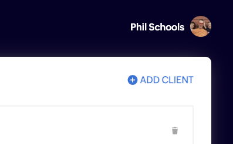
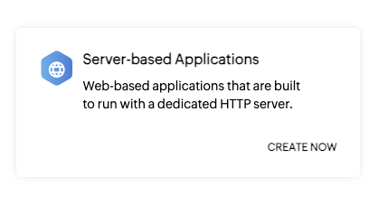
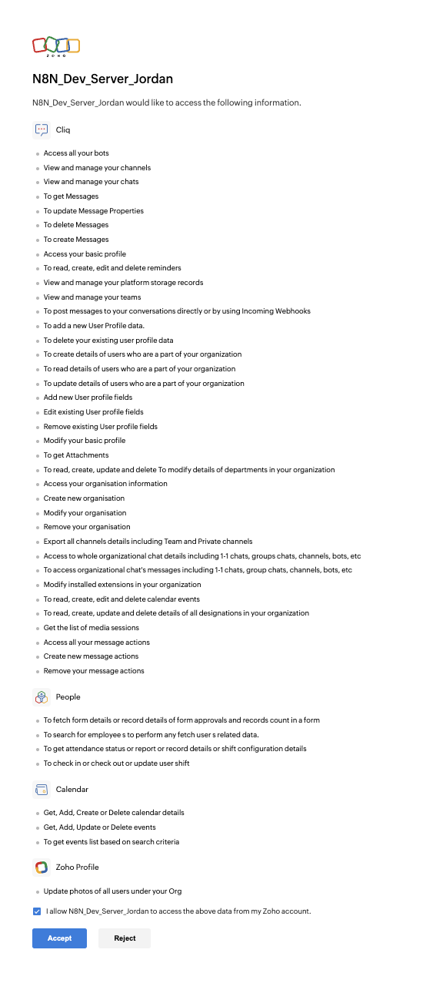

# Zoho Cliq Credentials Setup Guide

This guide is for the `Zoho Cliq OAuth2 API` credential used by this `Zoho Cliq` node.

It covers:

1. How to create the Zoho OAuth client correctly.
2. How to fill in the n8n credential fields correctly.
3. How scope selection works in this node.
4. Which scope packs and operations require a Zoho Cliq Organization Admin.

## Table of Contents

- [Official Zoho References](#official-zoho-references)
- [Before You Start](#before-you-start)
- [Step-By-Step Setup](#step-by-step-setup)
- [Scope Setup Methods](#scope-setup-methods)
- [Scope Packs](#scope-packs)
- [OAuth Helper Operations](#oauth-helper-operations)
- [Org Admin Only Operations in This Node](#org-admin-only-operations-in-this-node)
- [Full Supported Scope Catalog](#full-supported-scope-catalog)
- [Copy/Paste CSV for Raw Scope Input](#copypaste-csv-for-raw-scope-input)
- [Data Centers](#data-centers)
- [Troubleshooting](#troubleshooting)

## Official Zoho References

- [Zoho OAuth 2.0 Documentation](https://www.zoho.com/accounts/protocol/oauth.html)
- [Zoho Cliq REST API Authentication](https://www.zoho.com/cliq/help/restapi/v2/#authentication)

## Before You Start

Make sure you know these three things before creating the credential:

1. Your n8n base URL.
   Example: `https://n8n.mydomain.com`
2. Your Zoho Cliq data center.
   Example: `US`, `EU`, `IN`, `AU`, `JP`, `CN`, `SA`, `UK`, or `CA`
3. Whether you are a Zoho Cliq Organization Admin.
   Some operations in this node will not work for non-admin users even if the OAuth scopes are present.

## Step-By-Step Setup

### 1. Start in n8n

Create a new `Zoho Cliq OAuth2 API` credential from the `Zoho Cliq` node or from the Credentials page in n8n.

---

### 2. Copy the Redirect URI from n8n

In the credential UI, copy the OAuth redirect URL shown by n8n. Example: `https://n8n.mydomain.com/rest/oauth2-credential/callback`

You must paste this value into Zoho exactly as shown in your Instance.

If the redirect URI does not match your instance's redirect URI exactly, Zoho authorization will fail.

---

### 3. Open the Current Zoho API Console

Go to:

- [https://api-console.zoho.com](https://api-console.zoho.com)

If this is your first time there, complete Zoho's console registration flow first.

Important:
Zoho's official Cliq authentication page still references the older `accounts.zoho.com/developerconsole` wording and older field labels. The current console for creating clients is `https://api-console.zoho.com`, and the current equivalent field is `Homepage URL`.

---

### 4. Create a New OAuth Client

In the Zoho API Console:

1. Click `+ ADD CLIENT` in the top right of your API Console.



2. Choose `Server-based Applications`.



---

### 5. Fill in the Zoho Client Fields

For `Server-based Applications`, fill the fields like this:

1. `Client Name`
   Use any label that is easy for you to recognize later.
   Example: `n8n ZohoCliq Credentials`
2. `Homepage URL`
   Use the real base URL of your n8n instance.
   Example: `https://n8n.mydomain.com`
3. `Authorized Redirect URIs`
   Paste the exact redirect URI from the n8n credential.
   Example: `https://n8n.mydomain.com/rest/oauth2-credential/callback`

Then click `Create`.

---

### 6. Copy the Zoho OAuth Client Values

After the client is created, copy:

- `Client ID`
- `Client Secret`

Paste both into the `Zoho Cliq OAuth2 API` credential in n8n.

---

### 7. Finish the n8n Credential Fields

In the n8n credential:

1. `Client ID`
   Paste the value from Zoho.
2. `Client Secret`
   Paste the value from Zoho.
3. `Grant Type`
   Leave this on the default: `Authorization Code`
4. `Data Center`
   Select the Zoho data center that matches the client you created in Zoho. Default is `US`.
5. `Scope Mode`
   Choose how you want to request scopes. SEE `Scope Setup Methods` section below.

Important:
The selected `Data Center` must match the Zoho environment where you created the OAuth client. If your Zoho account is not on the US data center, do not leave this on the default `US`.

---

### 8. Optional: Allowed HTTP Request Domains

This field is optional.

You can use `Allowed HTTP Request Domains` as a safeguard if you plan to reuse this credential with n8n's `HTTP Request` node.

It does not change how the `Zoho Cliq` node itself authenticates. It is only an optional allowlist control for HTTP Request usage.

---

### 9. Connect the Account

After the fields are filled in, finish the OAuth connection in n8n and approve the consent screen in Zoho.

n8n and this credential handle refresh token creation and storage automatically.

You do not need to manually generate or paste refresh tokens.

When you click `Connect to Zoho Cliq` a new browser tab will open where Zoho will prompt you to grant the permissions for the scopes that you requested. Below is an example consent screen when all scopes have been requested. If you requested a different set of scopes than your consent screen will look a little different.



---

## Scope Setup Methods

This credential supports three scope setup methods.

| Scope Mode | When to use it | What it does |
| --- | --- | --- |
| `Include All Scopes` | Best for fastest setup, broad testing, or if you want the node ready for nearly everything immediately | Requests the node's full canonical scope set, including the optional Zoho People add-on scopes |
| `Select Scope Packs` | Best for least-privilege setups where you only want the groups of APIs you actually plan to use | Requests scopes from the packs you choose |
| `Raw Scope Input (CSV)` | Best only if you want very specific custom scope control | Lets you paste the exact comma-separated scopes yourself |

Important:

- Scope strings are case-sensitive in this credential.
- Copy them exactly as shown in this guide.
- Some Zoho scopes intentionally use mixed or lowercase segments such as `ZohoCliq.messages.CREATE`, `ZohoCliq.messageactions.READ`, and `ZohoCliq.Applications.update`.
- If you change the selected scopes later, reconnect the credential so Zoho can issue a token with the updated scopes.

### Important Note About `.ALL` Scope Packs

Several scope packs use Zoho wildcard scopes such as:

- `ZohoCliq.Channels.ALL`
- `ZohoCliq.Chats.ALL`
- `ZohoCliq.Teams.ALL`
- `ZohoCliq.Departments.ALL`
- `ZohoCliq.Designations.ALL`
- `ZohoCliq.Reminders.ALL`
- `ZohoCliq.StorageData.ALL`

Those wildcard scopes are intentional in this node.

They cover the corresponding `READ`, `CREATE`, `UPDATE`, and `DELETE` operations that the node checks per operation.

## Scope Packs

If you choose `Select Scope Packs`, these are the exact packs available in this node.

### 1. Core Messaging

Org Admin required: `No`

Use this pack for:

- channels
- chats
- messages
- threads
- reactions
- scheduled messages
- posting messages
- sharing files into conversations
- trigger bot calls

Exact scopes:

```txt
ZohoCliq.Channels.ALL,ZohoCliq.Chats.ALL,ZohoCliq.Messages.READ,ZohoCliq.Messages.UPDATE,ZohoCliq.Messages.DELETE,ZohoCliq.messages.CREATE,ZohoCliq.Webhooks.CREATE,ZohoCliq.messageactions.READ,ZohoCliq.messageactions.CREATE,ZohoCliq.messageactions.DELETE
```

---

### 2. Core People & Profile

Org Admin required: `No`

Use this pack for:

- users
- user status
- remote work basics
- reading user teams
- listing user layouts
- updating profile photo during user updates

Exact scopes:

```txt
ZohoCliq.Profile.READ,ZohoCliq.Profile.CREATE,ZohoCliq.Profile.UPDATE,ZohoCliq.Profile.DELETE,ZohoCliq.Users.CREATE,ZohoCliq.Users.READ,ZohoCliq.Users.UPDATE,Profile.orguserphoto.UPDATE
```

---

### 3. Core Teams & Org Structure

Org Admin required: `No`

Use this pack for:

- teams
- departments
- designations
- user fields

Exact scopes:

```txt
ZohoCliq.Teams.ALL,ZohoCliq.Departments.ALL,ZohoCliq.Designations.ALL,ZohoCliq.UserFields.CREATE,ZohoCliq.UserFields.UPDATE,ZohoCliq.UserFields.DELETE
```

---

### 4. Events & Calendar

Org Admin required: `No`

NOTE: This Scope Pack includes scopes from ZohoCalendar in addition to the ZohoCliq scopes, these ZohoCalendar.* scopes are required for working with the Zoho Cliq Events Resource.

Use this pack for:

- event calendars
- event list/get/create/update/delete
- event attachments
- event RSVP/status updates

Exact scopes:

```txt
ZohoCliq.CalendarEvents.ALL,ZohoCalendar.calendar.ALL,ZohoCalendar.event.ALL,ZohoCalendar.search.READ
```

---

### 5. Reminders & Tasks

Org Admin required: `No`

Use this pack for:

- all reminder lifecycle operations

Exact scopes:

```txt
ZohoCliq.Reminders.ALL
```

---

### 6. Files & Storage

Org Admin required: `No`

Use this pack for:

- file retrieval
- Cliq Database operations
- calls/meetings recording history and details

Exact scopes:

```txt
ZohoCliq.Attachments.READ,ZohoCliq.StorageData.ALL,ZohoCliq.MediaSession.READ
```

---

### 7. Org Admin (Organization/Organisation APIs)

Org Admin required: `Yes`

Use this pack only if you are a Zoho Cliq Organization Admin for your Organization. If you are unsure whether you are an Organization Admin for your Organization it is likely that you are not.

This pack is for:

- custom domain operations
- custom email operations
- role management operations
- maintenance and bulk export operations

Exact scopes:

```txt
ZohoCliq.Organisation.READ,ZohoCliq.Organisation.CREATE,ZohoCliq.Organisation.UPDATE,ZohoCliq.Organisation.DELETE,ZohoCliq.OrganizationChannels.READ,ZohoCliq.OrganizationChats.READ,ZohoCliq.OrganizationMessages.READ
```

---

### 8. Remote Work + Zoho People

Org Admin required: `No`

NOTE: This Scope Pack includes optional scopes from ZohoPeople in addition to the ZohoCliq scopes, these ZohoPeople.* scopes can optionally enhance the remote work resource and users resource responses with data from your Organization's Zoho People Account, if configured. This pack is an add-on. Basic remote work operations in this node still use the `Core People & Profile` pack.

Use this pack only if your Zoho Cliq setup is integrated with Zoho People and you want the extra People-backed remote work and profile data.

Exact scopes:

```txt
ZohoPeople.forms.READ,ZohoPeople.employee.READ,ZohoPeople.attendance.READ,ZohoPeople.attendance.UPDATE
```

---

### 9. Bot & Webhooks

Org Admin required: `No`

Use this pack for:

- retrieving bot subscribers
- widget map ticker operations

This pack does not replace `Core Messaging` for normal message posting, thread posting, file sharing, or trigger bot-call operations.

Exact scopes:

```txt
ZohoCliq.Bots.READ,ZohoCliq.Applications.update
```

---

## OAuth Helper Operations

This node also includes a custom `OAuth Helper` resource that can inspect the scopes currently granted to the connected credential.

These operations are no-op diagnostics helpers:

- they do not create, update, or delete anything in Zoho
- they are useful for troubleshooting missing-scope errors
- they are useful for workflow branching when you want to check what the current token can do before attempting later Zoho Cliq operations

You can find them in the `Zoho Cliq` node under:

- `Resource` -> `OAuth Helper`

Available helper operations:

- `Get Granted Scopes`
  Returns the scopes stored on the current token, whether scope data is present on the token, and whether a refresh token is present. It can also optionally include the full node-supported scope catalog for comparison.
- `List Scope Packs`
  Returns every scope pack defined by this node, the scopes inside each pack, whether the current token fully satisfies each pack, and which scopes are missing for any incomplete pack.
- `Check Scope Pack`
  Lets you select one scope pack and returns a direct yes/no result for that pack, plus the exact missing scopes if the current token does not fully satisfy it.

Common workflow uses:

- explain why a later Zoho Cliq operation is failing with a scope-related error
- decide whether to continue down one branch or another in an `IF` or `Switch` node
- confirm that a newly reconnected credential actually received the scopes you expected

## Org Admin Only Operations in This Node

If you are not a Zoho Cliq Organization Admin, do not use the following resource areas with this node:

- `Bulk Action`
  Operations: `Export Conversations`, `Export Channels`, `Export Members in a Conversation`, `Export Messages`
- `Custom Domain`
  Operations: `Get`, `Add`, `Verify`, `Delete`
- `Custom Email`
  Operations: `Verify Custom Email`, `Update Mail Configuration`
- `Role`
  Operations: `List Roles`, `Get Role`, `Create Role`, `Update Role`, `Delete Role`, `Get Role Permissions`, `Update Role Permissions`, `Add Role Permissions`, `Remove Role Permissions`, `Get Users In Role`, `Add Users To Role`, `Remove Users From Role`

Notes:

- The `Role -> Build Permissions JSON Payload` helper does not call Zoho and does not require Org Admin access by itself.
- Having the `Org Admin (Organization/Organisation APIs)` scope pack is not enough if the connected Zoho account is not actually an Organization Admin.
- Zoho may grant the Organisation scopes when requested in this credential, but silently reject requests to Org Admin specific endpoints if you are not an Org Admin.
- Non-admin users should simply avoid these resource areas and choose only the non-admin scope packs.

## Full Supported Scope Catalog

Every scope below is supported by this node's credential and may be requested by `Include All Scopes`, `Select Scope Packs`, or `Raw Scope Input (CSV)`.

### Messaging, Conversation, and Reaction Scopes

| Scope | What it enables in this node |
| --- | --- |
| `ZohoCliq.Channels.ALL` | Full channel coverage in this node, including create/get/list/update/delete, membership changes, approval/rejection, archive/unarchive, add/remove bot, and thread auto-follow |
| `ZohoCliq.Chats.ALL` | Full chat coverage in this node, including list/get members, mute/unmute, pin/unpin messages, leave chat, and thread follower/list operations that are chat-backed |
| `ZohoCliq.Messages.READ` | Message retrieval operations and thread main-message lookup |
| `ZohoCliq.Messages.UPDATE` | Edit message operations |
| `ZohoCliq.Messages.DELETE` | Delete message operations |
| `ZohoCliq.messages.CREATE` | Scheduled message operations in this node. Keep the lowercase `messages` exactly as shown |
| `ZohoCliq.Webhooks.CREATE` | Post message, post to thread, create thread, share file into a conversation, and trigger bot-call operations |
| `ZohoCliq.messageactions.READ` | Retrieve reactions |
| `ZohoCliq.messageactions.CREATE` | Add reactions |
| `ZohoCliq.messageactions.DELETE` | Remove reactions |

### People, Profile, and User Status Scopes

| Scope | What it enables in this node |
| --- | --- |
| `ZohoCliq.Profile.READ` | Get current status, list custom statuses, and retrieve remote-work status |
| `ZohoCliq.Profile.CREATE` | Create a new saved user status |
| `ZohoCliq.Profile.UPDATE` | Set current status, create transient status, remote work check-in, and remote work check-out |
| `ZohoCliq.Profile.DELETE` | Delete saved statuses and clear transient status |
| `ZohoCliq.Users.CREATE` | Create user operations |
| `ZohoCliq.Users.READ` | Get/list users, list user layouts, get a user's teams, get user status, and read user-field metadata through the node |
| `ZohoCliq.Users.UPDATE` | Update user operations |
| `Profile.orguserphoto.UPDATE` | Update a user's profile photo during user update operations |

### Teams, Departments, Designations, and User Fields

| Scope | What it enables in this node |
| --- | --- |
| `ZohoCliq.Teams.ALL` | Full team coverage in this node, including create/get/list/update/delete and membership changes |
| `ZohoCliq.Departments.ALL` | Full department coverage in this node, including create/get/list/update/delete and membership changes |
| `ZohoCliq.Designations.ALL` | Full designation coverage in this node, including create/get/list/update/delete and membership changes |
| `ZohoCliq.UserFields.CREATE` | Create user field operations |
| `ZohoCliq.UserFields.UPDATE` | Update user field operations |
| `ZohoCliq.UserFields.DELETE` | Delete user field operations |

### Reminders, Files, Storage, Calls, and App Integration

| Scope | What it enables in this node |
| --- | --- |
| `ZohoCliq.Reminders.ALL` | Full reminder coverage in this node, including create/get/list/update/delete, assignment, completion state, snooze, and remind-assignee actions |
| `ZohoCliq.Attachments.READ` | Get file operations |
| `ZohoCliq.StorageData.ALL` | Full Cliq Database coverage in this node, including create/get/list/update/delete record operations |
| `ZohoCliq.MediaSession.READ` | Calls and meetings recording history and participant/detail operations |
| `ZohoCliq.Bots.READ` | Retrieve bot subscribers |
| `ZohoCliq.Applications.update` | Widget Map Ticker operations. Keep the lowercase `update` exactly as shown |

### Events and Calendar Scopes

| Scope | What it enables in this node |
| --- | --- |
| `ZohoCliq.CalendarEvents.ALL` | Event coverage in this node, including get calendars and core event operations |
| `ZohoCalendar.calendar.ALL` | Calendar-backed event create/get/list/update/delete coverage |
| `ZohoCalendar.event.ALL` | Event create/get/list/update/delete, RSVP/status changes, and event attachment upload coverage |
| `ZohoCalendar.search.READ` | Event list search support |

### Org Admin Scopes

These scopes require a Zoho Cliq Organization Admin for the resource areas they protect in this node.

| Scope | What it enables in this node |
| --- | --- |
| `ZohoCliq.Organisation.READ` | Read-side custom domain, custom email, and role operations |
| `ZohoCliq.Organisation.CREATE` | Create-side custom domain and role operations |
| `ZohoCliq.Organisation.UPDATE` | Update-side custom domain, custom email, and role operations |
| `ZohoCliq.Organisation.DELETE` | Delete-side role operations where Zoho requires delete-level organization permission |
| `ZohoCliq.OrganizationChannels.READ` | Bulk export of organization channels |
| `ZohoCliq.OrganizationChats.READ` | Bulk export of conversations and conversation members |
| `ZohoCliq.OrganizationMessages.READ` | Bulk export of messages |

### Zoho People Add-On Scopes

These are optional add-on scopes for Zoho People integration.

| Scope | What it enables in this node |
| --- | --- |
| `ZohoPeople.forms.READ` | Extra Zoho People-backed detail used by user and remote-work reads when Zoho People integration exists |
| `ZohoPeople.employee.READ` | Extra employee data used by user and remote-work reads when Zoho People integration exists |
| `ZohoPeople.attendance.READ` | Attendance-backed remote-work and profile detail reads when Zoho People integration exists |
| `ZohoPeople.attendance.UPDATE` | Attendance-backed remote-work check-in and check-out enhancements when Zoho People integration exists |

## Copy/Paste CSV for Raw Scope Input

If you choose `Raw Scope Input (CSV)`, this is the full exact CSV used by `Include All Scopes` in this node:

```txt
ZohoCliq.Bots.READ,ZohoCliq.Channels.ALL,ZohoCliq.Chats.ALL,ZohoCliq.Messages.READ,ZohoCliq.Messages.UPDATE,ZohoCliq.Messages.DELETE,ZohoCliq.messages.CREATE,ZohoCliq.Profile.READ,ZohoCliq.Reminders.ALL,ZohoCliq.StorageData.ALL,ZohoCliq.Teams.ALL,ZohoCliq.Webhooks.CREATE,ZohoCliq.Profile.CREATE,ZohoCliq.Profile.DELETE,ZohoCliq.Users.CREATE,ZohoCliq.Users.READ,ZohoCliq.Users.UPDATE,Profile.orguserphoto.UPDATE,ZohoCliq.UserFields.CREATE,ZohoCliq.UserFields.UPDATE,ZohoCliq.UserFields.DELETE,ZohoCliq.Profile.UPDATE,ZohoCliq.Attachments.READ,ZohoCliq.Departments.ALL,ZohoCliq.Organisation.READ,ZohoCliq.Organisation.CREATE,ZohoCliq.Organisation.UPDATE,ZohoCliq.Organisation.DELETE,ZohoCliq.OrganizationChannels.READ,ZohoCliq.OrganizationChats.READ,ZohoCliq.OrganizationMessages.READ,ZohoCliq.Applications.update,ZohoCliq.CalendarEvents.ALL,ZohoCalendar.calendar.ALL,ZohoCalendar.event.ALL,ZohoCalendar.search.READ,ZohoCliq.Designations.ALL,ZohoCliq.MediaSession.READ,ZohoCliq.messageactions.READ,ZohoCliq.messageactions.CREATE,ZohoCliq.messageactions.DELETE,ZohoPeople.forms.READ,ZohoPeople.employee.READ,ZohoPeople.attendance.READ,ZohoPeople.attendance.UPDATE
```

## Data Centers

Select the same data center in the n8n credential that matches the Zoho environment where you created the OAuth client.

| Data Center | Domain | Base API URI |
| --- | --- | --- |
| United States | `.com` | `https://cliq.zoho.com/` |
| Europe | `.eu` | `https://cliq.zoho.eu/` |
| India | `.in` | `https://cliq.zoho.in/` |
| Australia | `.au` | `https://cliq.zoho.com.au/` |
| China | `.cn` | `https://cliq.zoho.com.cn/` |
| Japan | `.jp` | `https://cliq.zoho.jp/` |
| Saudi Arabia | `.sa` | `https://cliq.zoho.sa` |
| United Kingdom | `.uk` | `https://cliq.zoho.uk` |
| Canada | `.zohocloud.ca` | `https://cliq.zohocloud.ca` |

## Troubleshooting

### Redirect URI mismatch

If Zoho rejects the OAuth flow, compare the redirect URI in Zoho against the one shown in n8n and make sure they are exactly identical.

### Wrong data center

If authorization or credential tests fail unexpectedly, confirm that:

- the Zoho OAuth client was created in the correct Zoho environment
- the credential's `Data Center` matches that environment

### Scope changes do not apply until reconnect

If you add or remove scopes, reconnect the credential so Zoho can issue a token with the new scope set. You will be prompted to grant access to the new scopes by Zoho in a new tab in your browser.

### Org Admin operations fail for non-admin users

If `Bulk Action`, `Custom Domain`, `Custom Email`, or `Role` operations fail with permission-related errors, the most common cause is that the connected Zoho account is not an Organization Admin.

### Raw CSV scope errors

If you use `Raw Scope Input (CSV)`, copy the scopes exactly as shown in this guide.

Common mistakes:

- changing the case of `ZohoCliq.messages.CREATE`
- changing the case of `ZohoCliq.messageactions.*`
- changing the case of `ZohoCliq.Applications.update`
- removing required commas
